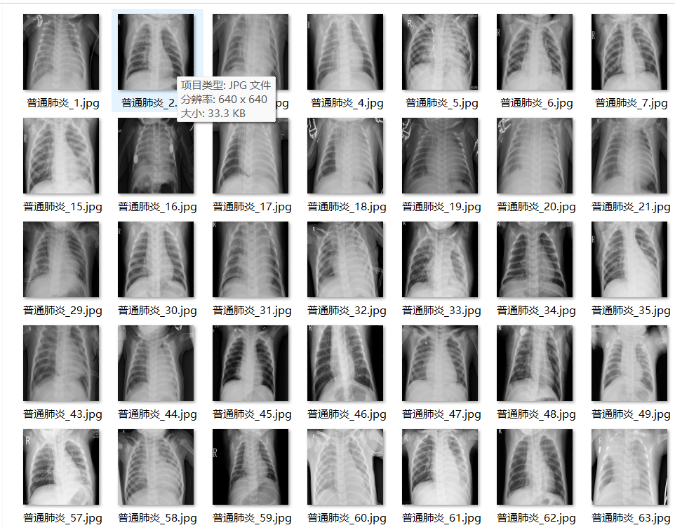
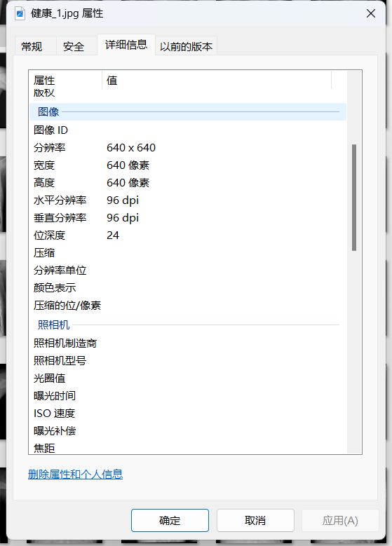

# Pneumonia-Image Classification Dataset

Dataset Information Introduction: The number of images in the folder "Health" is: 1575
The number of images in the folder "COVID-19" is: 1728
The number of images in the folder "Common Pneumonia" is: 4265
The total number of images in all subfolders: 7568
+
+
+
For any inquiries, please just ask. I don't have a friend verification, so you can directly send messages to me without needing my permission. You can see them.
Search for me and send your questions at once, I will reply to you, sometimes I am busy, you describe clearly your question and intention.
When I am free, I will also reply to you, no need for formalities, this will make the efficiency higher.
The phone number is the same as above, if I forget to reply or you are impatient, you can send SMS or call.

## Images

Here is a pay link on Stripe ( https://buy.stripe.com/3cs8yP7sY87d0vu9AB ). Please contact me lonlonago@foxmail.com after funding $89, and I will send you a complete data files , thank you!

